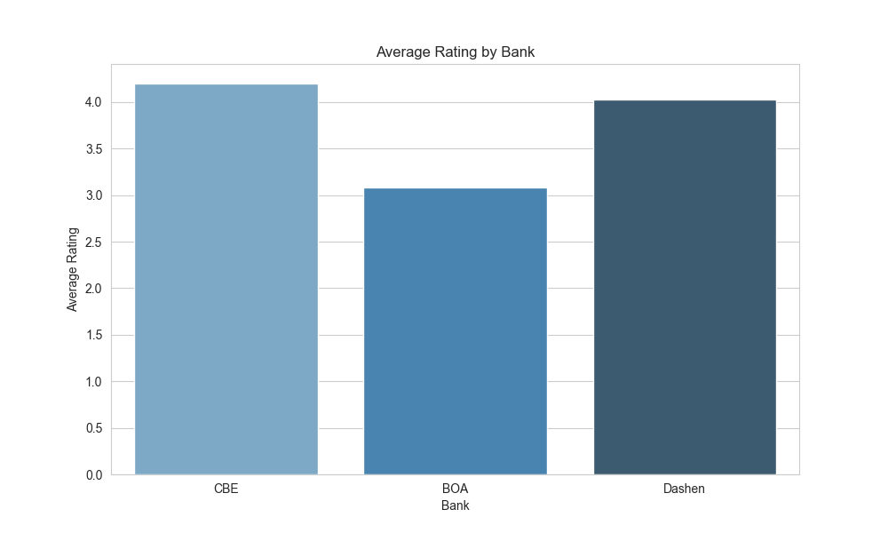
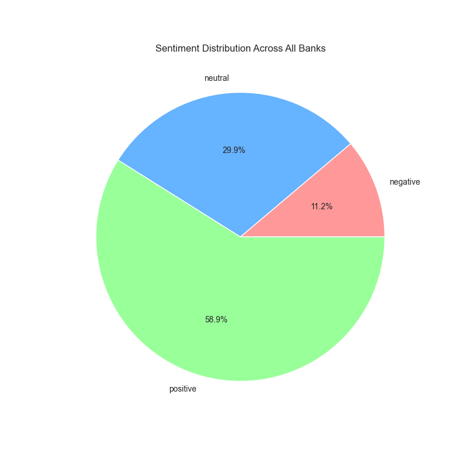
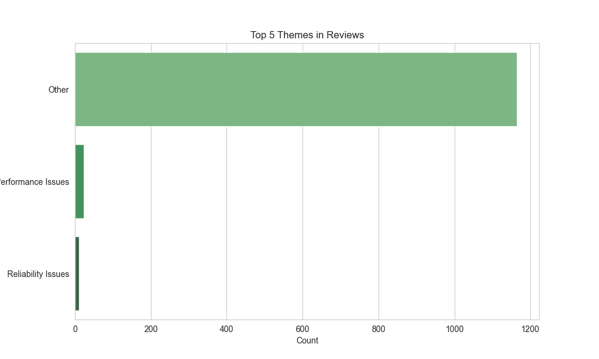
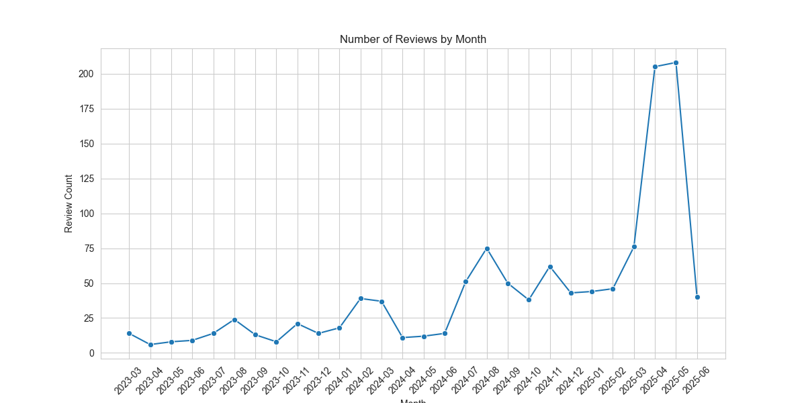

# Task 4: Insights and Visualizations

## Insights
### 1. Average Rating by Bank
- CBE: 4.2
- BOA: 3.08
- Dashen: 4.03

### 2. Sentiment Distribution
- CBE (positive): 264 reviews
- CBE (negative): 25 reviews
- CBE (neutral): 111 reviews
- BOA (neutral): 136 reviews
- BOA (positive): 191 reviews
- BOA (negative): 73 reviews
- Dashen (positive): 252 reviews
- Dashen (neutral): 112 reviews
- Dashen (negative): 36 reviews

### 3. Top 5 Themes
- Other: 1165 reviews
- Performance Issues: 24 reviews
- Reliability Issues: 11 reviews

## Visualizations
- Average Rating by Bank: 
- Sentiment Distribution: 
- Top 5 Themes: 
- Reviews by Month: 
